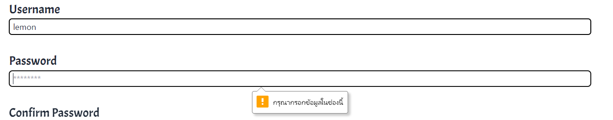
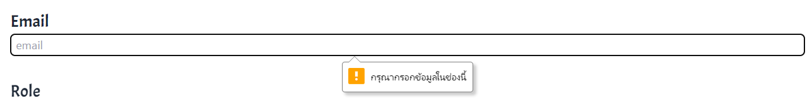
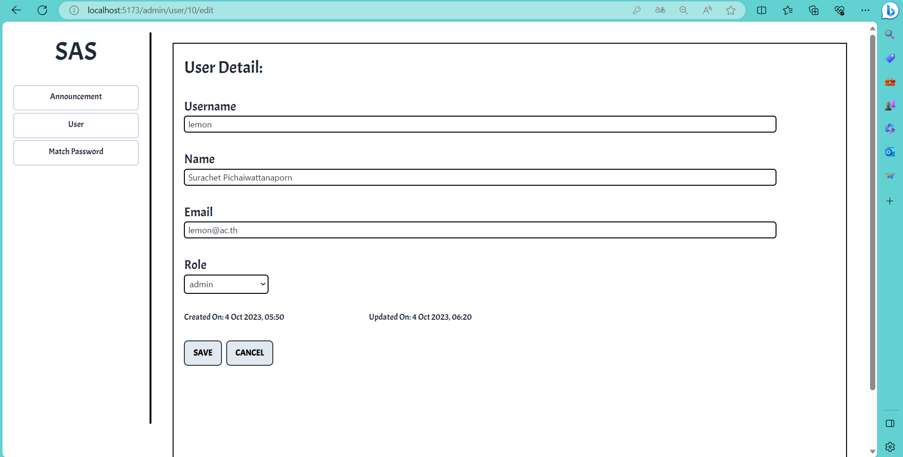

# Integrated IT Project - SIT Announcement System
A single-page web application that displays information about numerous announcements

## Software development environment

> Front-end (Parts of Users Interaction)
- Create the user interface using `Vue.js` (Organize document structure, display format, and many functionalities as necessary to be in accordance with requirements) and use `TailwindCSS` to adorn the user interface.

 

> Back-end (Parts of Resource Provider)
- Through defined APIs and methods created using the Java Programming language on the `Spring Boot Framework`, handle requests originating from front-end / client browsers.

 

> Database (Parts of Stored Data)
- Utilize the SQL language with the `MySQL` software to store data in the form of a relational database (row-column-table).

 

> DevOps (Parts of Deployment)
- Configure the virtual machine powered by Ubuntu and deploy the created software to the faculty server using `Docker`
     and `command line interface`.

 

> Project Management Part
- Daily meetings 4 times a week with team members and 2 meetings with advisors at the beginning and end of each sprint
   via `Microsoft Teams`.
- Utilize TaskBoard Online - `Trello` to view your to-do list and the status of each task extracted from Product Backlog Item.
- Shared Code via `GitHub`.

 
   
   

## User Interface and Functionality
> Admin Role

**1. `[CRUD Operations] - Announcement List Display`** : ผู้ใช้ที่มี Role `Admin` จะเห็น รายละเอียดเบื้องต้นของตัวประกาศ โดยเรียงลำดับจากประกาศที่เพิ่มาล่าสุดก่อนแล้วลดหลั่นลงไปตามลำดับ ข้อมูลที่แสดงจะประกอบไปด้วย : หัวข้อการประกาศ, ประเภทของการประกาศ, วันเวลาเปิด-ปิดของตัวประกาศ (แสดงวัน-เวลาตาม Timezone บน browser ของผู้ใช้), ตัวเลือกว่าประกาศนี้จะแสดงให้ ผู้ใช้ทั่วไปเห็นหรือไม่ และจำนวนครั้งที่มีการเข้าดูการประกาศนั้นๆจากผู้ใช้ที่มี Role `User` ทั่วไป

**2. `[CRUD Operations] - Add New Announcement`** : ผุ้ใช้ที่มี Role `Admin` สามารถเพิ่มข้อมูลประกาศใหม่ได้ โดยคลิกที่ปุ่ม `Add Announcement` ที่มุมบนขวา

* เมื่อเข้าสู่หน้า Add announcement ก็สามารถทำการกรอกข้อมูลสำหรับตัว announcement ใหม่ที่ต้องการเพิ่มได้เลย โดยกำหนดไว้ว่าต้องทำการกรอกข้อมูล ส่วนที่เป็น Title , Category , Description ทั้ง 3 ส่วนนี้ก่อนจึงจะกดปุ่ม `submit` เพื่อเป็นการสร้าง announcement ใหม่ได้ หรือ สามารถกดปุ่ม `cancel` ได้เลยถ้าต้องการยกเลิกการทำงาน

* เมื่อทำการกด `submit` ตัวประกาศก็จะปรากฎขึ้นในหน้า Announcement List

**3. `[CRUD Operations] - View & Edit Exist Announcement`** : ในหน้าของ Announcement List ผู้ใช้ที่มี Role Admin สามารถคลิกปุ่ม `View` ที่ Announcement ตัวใดตัวหนึ่ง เพื่อดูรายละเอียดทั้งหมดของ Announcement นั้นๆ

* สามารถคลิกปุ่ม Edit เพื่อทำการแก้ไขข้อมูล Announcement ได้ โดยข้อมูลเดิมของตัว Announcement ก็จะถูกเติมลงในช่องว่างพร้อมให้แก้ไขได้เลย กรณีที่ไม่ได้ทำการแก้ไข ข้อมูลไม่มีการเปลี่ยนแปลง จะไม่สามารถคลิกปุ่ม `submit` ได้ แต่เมื่อทำการแก้ไขเรียบร้อย ข้อมูลมีการเปลี่ยนแปลงสามารถคลิกปุ่ม `submit` เพื่อบันทึกการเปลี่ยนแปลงได้ หรือ สามารถคลิกปุ่ม `cancel` เพื่อยกเลิกการทำงานได้

**4. `[CRUD Operations] - Delete Exist Announcement`** : ในหน้าของ Announcement List ผู้ใช้ที่มี Role Admin สามารถคลิกปุ่ม `delete` ที่ Announcement ตัวใดตัวหนึ่ง เพื่อทำการลบตัว announcement นั้นทิ้งได้ โดยจะมี alert เตือนผู้ใช้ก่อนว่าต้องการจะลบจริงหรือไม่ ป้องกันการลบโดยไม่ได้ตั้งใจ ถ้ายืนยันที่จะลบก็คลิกปุ่ม `ok` ตัว announcement นั้นก็จะหายไป ถ้าคลิกปุ่ม `cancel` ก็จะเป็นการยกเลิกการทำงาน

**5. `Timezone`** : แสดงผลวัน-เวลา dynamic ตาม local timezone ที่กำหนดบน browser 

<i>default timezone (เวลาประเทศไทย)</i>

<i>change timezone</i>

 

**6. `[CRUD Operations] - User List Display`** : สามารถคลิกที่แถบนำทาง (Navigation Bar) ทางด้านซ้าย ในส่วนของ User เพื่อแสดงรายการ user ได้ ซึ่งข้อมูลที่แสดงจะประกอบไปด้วย Username , Name (ทั้งชื่อ-นามสกุล) , E-mail , Role (admin , announcer , user ทั่วไป), CreatedOn (วัน-เวลาที่สร้าง User นั้นขึ้นมา) และ UpdatedOn (วัน-เวลาที่ทำการแก้ไขข้อมูล User ที่มีอยู่ ถ้าไม่ได้มีการแก้ไขเกิดขึ้น ข้อมูลจะต้องตรงกับ createdOn)

**7. `[CRUD Operations] - Add New User`** : ในหน้าของ User List ผู้ใช้ที่มี Role Admin สามารถคลิกปุ่ม `Add User` เพื่อทำการเพิ่มข้อมูล User ใหม่ได้

- โดยในการสร้าง User ใหม่นั้นมีเงื่อนไข ดังนี้
   - ต้องกรอกข้อมูลให้ครบทุก Field ถ้ากรอกข้อมูลไม่ครบจะไม่สามารถ submit ได้และจะมี pop-up ขึ้นแจ้งเตือนใน field ถัดไปที่จำเป็นต้องกรอกข้อมูล

   - มีการเช็คข้อมูลใน field : `Username` , `Name` และ `Email` ต้องมีคุณสมบัติเป็น Unique คือข้อมูลต้องห้ามซ้ำกับข้อมูลที่มีเก็บไว้อยู่แล้ว

   - มีการเช็ค format ของ field `password` จำเป็นต้องประกอบไปด้วย ตัวอักษร A-Z , a-z , ตัวเลข และ อักขระพิเศษ รวมทั้งมีความยาวอยู่ระหว่าง 8 - 14 ตัว เพื่อเพิ่มความซับซ้อน ลดโอกาสที่จะถูกคาดเดาข้อมูลรหัสผ่านได้

   - ข้อมูลใน field `confirm password` จะต้องตรงกับข้อมูลใน field `password`

   - มีการเช็ค pattern ของ field `Email` จำเป็นต้องสอดคล้องกับ input type ที่เป็น email (มี @ ตามด้วยตัวอักษร + มี . ต่อท้ายตามด้วยตัวอักษร)

-   เมื่อกรอกข้อมูลจนครบทุก field และ ถูกต้องตามเงื่อนไขที่กำหนด สามารถคลิกที่ปุ่ม save จะมี Alert ขึ้นมาถามก่อนว่าต้องการบันทึกข้อมูล user นี้หรือไม่ ถ้าต้องการก็คลิก ok เพื่อบันทึกข้อมูล User ถ้ายังมีส่วนที่ตกหล่น ต้องการแก้ไขก็กด cancel ออกมาก่อนได้ แต่ถ้าต้องการยกเลิกการบันทึกข้อมูล user ใหม่ก็คลิกปุ่ม cancel ข้างปุ่ม save ได้เลยจะเป็นการยกเลิกการทำงาน ซึ่งก็จะมี Alert เตือนเช่นกันว่าต้องการจะยกเลิกจริงหรือไม่

- เมื่อกลับมายังหน้า User List ก็จะมีข้อมูลของ User ที่สร้างไปก่อนหน้าแสดงขึ้นมา

**8. `[CRUD Operations] - Update Exist User`** : ในหน้าของ User List ผู้ใช้ที่มี Role Admin สามารถคลิกปุ่ม `edit` ที่ข้อมูล user ตัวใดตัวหนึ่ง เพื่อดูรายละเอียดทั้งหมดของ user นั้นๆ

* ข้อมูลเดิมของตัว User จะถูกเติมลงใน input field แต่ละ field ให้โดยอัตโนมัติ สามารถทำการแก้ไขข้อมูล User ได้เลย กรณีที่ไม่ได้ทำการแก้ไข ข้อมูลไม่มีการเปลี่ยนแปลงคลิกปุ่ม `save` ก็จะนำกลับไปหน้า User List , หรือถ้าคลิกปุ่ม `cancel` ก็จะเป็นการยกเลิกการทำงาน แต่ถ้าเมื่อใดที่ได้ทำการแก้ไขข้อมูลเรียบร้อย ข้อมูลมีการเปลี่ยนแปลงสามารถคลิกปุ่ม `save` เพื่อบันทึกการเปลี่ยนแปลงได้ โดยจะมี Alert ขึ้นมาเตือนก่อนว่าต้องการจะบันทึกการแก้ไขนี้หรือไม่ ถ้าต้องการก็ให้เลือก `ok` ถ้ายังต้องการแก้ไขเพิ่มเติมก็เลือก `cancel` ออกมาก่อนได้ เพื่อทำการแก้ไขเพิ่มเติมได้

- เมื่อกลับมายังหน้า User List ข้อมูล User ตัวที่มีการแก้ไขก็จะเปลี่ยนตามข้อมูลที่บันทึกลงไปใหม่

