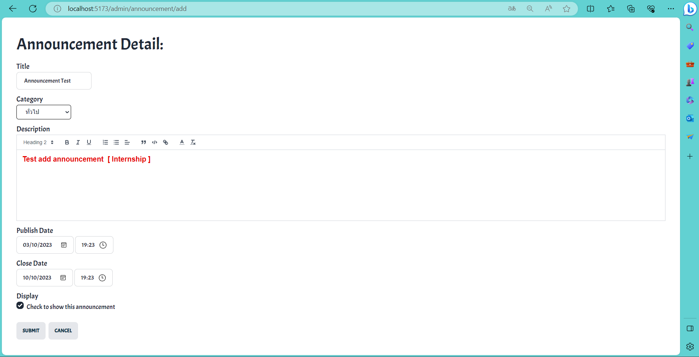

# Integrated IT Project - SIT Announcement System
A single-page web application that displays information about numerous announcements

## Software development environment

> Front-end (Parts of Users Interaction)
- Create the user interface using `Vue.js` (Organize document structure, display format, and many functionalities as necessary to be in accordance with requirements) and use `TailwindCSS` to adorn the user interface.

 

> Back-end (Parts of Resource Provider)
- Through defined APIs and methods created using the Java Programming language on the `Spring Boot Framework`, handle requests originating from front-end / client browsers.

 

> Database (Parts of Stored Data)
- Utilize the SQL language with the `MySQL` software to store data in the form of a relational database (row-column-table).

 

> DevOps (Parts of Deployment)
- Configure the virtual machine powered by Ubuntu and deploy the created software to the faculty server using `Docker`
     and `command line interface`.

 

> Project Management Part
- Daily meetings 4 times a week with team members and 2 meetings with advisors at the beginning and end of each sprint
   via `Microsoft Teams`.
- Utilize TaskBoard Online - `Trello` to view your to-do list and the status of each task extracted from Product Backlog Item.
- Shared Code via `GitHub`.

 
   
   

## User Interface and Functionality
> Admin Role

1. **`[CRUD Operations] - Announcement List Display`** : ผู้ใช้ที่มี Role `Admin` จะเห็น รายละเอียดเบื้องต้นของตัวประกาศ โดยเรียงลำดับจากประกาศที่เพิ่มาล่าสุดก่อนแล้วลดหลั่นลงไปตามลำดับ ข้อมูลที่แสดงจะประกอบไปด้วย : หัวข้อการประกาศ, ประเภทของการประกาศ, วันเวลาเปิด-ปิดของตัวประกาศ (แสดงวัน-เวลาตาม Timezone บน browser ของผู้ใช้), ตัวเลือกว่าประกาศนี้จะแสดงให้ ผู้ใช้ทั่วไปเห็นหรือไม่ และจำนวนครั้งที่มีการเข้าดูการประกาศนั้นๆจากผู้ใช้ที่มี Role `User` ทั่วไป

2. **`[CRUD Operations] - Add New Announcement`** : ผุ้ใช้ที่มี Role `Admin` สามารถเพิ่มข้อมูลประกาศใหม่ได้ โดยคลิกที่ปุ่ม `Add Announcement` ที่มุมบนขวา

* เมื่อเข้าสู่หน้า Add announcement ก็สามารถทำการกรอกข้อมูลสำหรับตัว announcement ใหม่ที่ต้องการเพิ่มได้เลย โดยกำหนดไว้ว่าต้องทำการกรอกข้อมูล ส่วนที่เป็น Title , Category , Description ทั้ง 3 ส่วนนี้ก่อนจึงจะกดปุ่ม `submit` เพื่อเป็นการสร้าง announcement ใหม่ได้ หรือ สามารถกดปุ่ม `cancel` ได้เลยถ้าต้องการยกเลิกการทำงาน

* เมื่อทำการกด `submit` ตัวประกาศก็จะปรากฎขึ้นในหน้า Announcement List

3. **`[CRUD Operations] - View & Edit Announcement`** : ในหน้าของ Announcement List ผู้ใช้ที่มี Role Admin สามารถคลิกปุ่ม `View` ที่ Announcement ตัวใดตัวหนึ่ง เพื่อดูรายละเอียดทั้งหมดของ Announcement นั้นๆ

* สามารถคลิกปุ่ม Edit เพื่อทำการแก้ไขข้อมูล Announcement ได้ โดยข้อมูลเดิมของตัว Announcement ก็จะถูกเติมลงในช่องว่างพร้อมให้แก้ไขได้เลย กรณีที่ไม่ได้ทำการแก้ไข ข้อมูลไม่มีการเปลี่ยนแปลง จะไม่สามารถคลิกปุ่ม `submit` ได้ แต่เมื่อทำการแก้ไขเรียบร้อย ข้อมูลมีการเปลี่ยนแปลงสามารถคลิกปุ่ม `submit` เพื่อบันทึกการเปลี่ยนแปลงได้ หรือ สามารถคลิกปุ่ม `cancel` เพื่อยกเลิกการทำงานได้

4. **`[CRUD Operations] - Delete Announcement`** : ในหน้าของ Announcement List ผู้ใช้ที่มี Role Admin สามารถคลิกปุ่ม `delete` ที่ Announcement ตัวใดตัวหนึ่ง เพื่อทำการลบตัว announcement นั้นทิ้งได้ โดยจะมี alert เตือนผู้ใช้ก่อนว่าต้องการจะลบจริงหรือไม่ ป้องกันการลบโดยไม่ได้ตั้งใจ ถ้ายืนยันที่จะลบก็คลิกปุ่ม `ok` ตัว announcement นั้นก็จะหายไป ถ้าคลิกปุ่ม `cancel` ก็จะเป็นการยกเลิกการทำงาน

5. **`Timezone`** : แสดงผลวัน-เวลา dynamic ตาม local timezone ที่กำหนดบน browser 

<i>default timezone (เวลาประเทศไทย)</i>

<i>change timezone</i>

